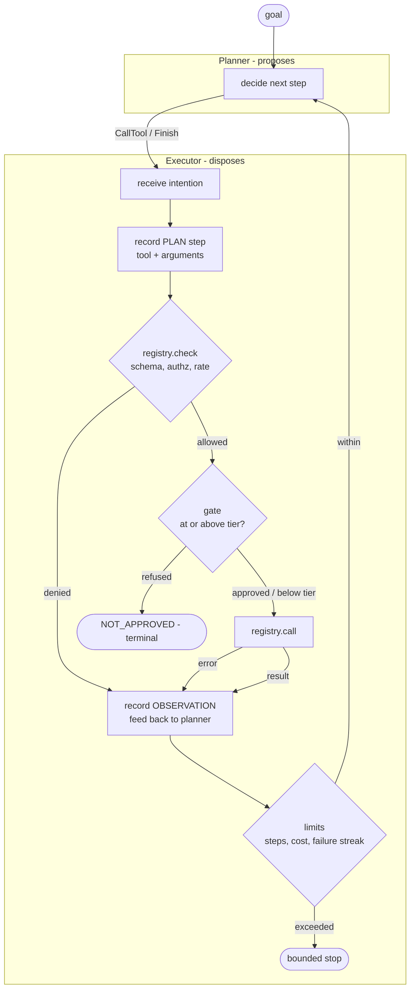

# agent-harness

**The fabric agents run inside.** Bounded execution, a governed tool registry,
tiered memory, human oversight keyed to risk, and deterministic replay.

Built on [`ai-golden-path`](https://github.com/krishnamami/ai_golden_path)@v1.0.0,
which supplies configuration, structured logging, correlation ids, tracing, the
error contract and the CI gate — so none of that is re-litigated here.

---

## The problem this solves

One agent script is easy. A weekend gets you a loop that asks a model what to do
and then does it, and it demos well.

A hundred agents inside an enterprise is a different problem, and it is not a
harder version of the same problem. Those agents call real systems, spend real
money, and touch regulated data. Something has to be able to answer:

- Which tools may **this** agent call, on whose authority?
- How much may a single run spend before it stops?
- What stops it looping forever when a downstream is flaky?
- Which actions does a human see, and which would drown the reviewer?
- An agent did something in March. **Explain it.**

Most agent frameworks answer none of these, because they are optimising for the
first hour of developer experience. The answers get bolted on later, per team,
inconsistently — which is the same failure mode as security-by-discipline, and
it fails the same way.

This repository takes the opposite position: **the loop is the control point.**
If the bounds are structural, every agent built on the harness inherits them,
and nobody has to remember.

---

## What a harness is, and is not

A harness is not an agent, the way an application server is not a web
application. It is the thing agents run inside.

The harness owns the loop, the limits, the registry, the policy hooks, the
memory contracts, and the trace. It does **not** own your prompt, your model
choice, your tools, or your domain. Those belong to the service.

The clearest expression of that line is the planner/executor split:

> **The planner proposes. The executor disposes.**

A planner returns an *intention* — call this tool with these arguments, or
finish with this output. It holds no reference to the tool registry, so there is
no route from *"the model asked for it"* to *"the tool ran"* that skips
authorisation. Not because the code is careful, but because the reference does
not exist.



Three things in that diagram are load-bearing and easy to get wrong:

1. **The PLAN step is recorded before authorisation runs.** A decision that was
   prevented still happened, and a trace that only contains permitted actions
   cannot answer *"did it try?"*
2. **Authorisation runs before the gate.** Asking a human to approve something
   policy was going to deny anyway trains reviewers to rubber-stamp, and leaks
   the existence of tools the caller may not know about.
3. **A denial is an observation; a refusal is terminal.** The planner sees a
   policy denial and may route around it. A human saying *no* ends the run — fed
   back as an observation, it produces an agent that rephrases its request until
   someone says yes.

---

## The decisions

Every non-obvious choice is written down, with the alternatives that were
rejected and why. The rejected-alternatives section is the load-bearing part:
it is the difference between a decision and a habit.

| ADR | Decision |
|-----|----------|
| [0001](docs/adr/0001-built-on-the-golden-path.md) | Built on `ai-golden-path@v1.0.0` rather than from scratch |
| [0002](docs/adr/0002-policy-contracts-not-implementations.md) | The harness ships policy **contracts**, not policies |
| [0003](docs/adr/0003-bounded-by-construction.md) | Runs are bounded by construction, not by monitoring |
| [0004](docs/adr/0004-planner-executor-split.md) | The planner proposes, the executor disposes |
| [0005](docs/adr/0005-failures-are-observations.md) | A failure is an observation; a streak is a stop |
| [0006](docs/adr/0006-four-memory-tiers.md) | Four memory tiers, not one store |
| [0007](docs/adr/0007-replay-through-the-real-executor.md) | Replay runs through the real executor, and reports divergence |
| [0008](docs/adr/0008-oversight-is-tiered-and-refusals-are-terminal.md) | Oversight is tiered, and a refusal is terminal |
| [0009](docs/adr/0009-the-regulated-overlay.md) | One overlay module, not a fork |
| [0010](docs/adr/0010-bounded-in-time.md) | Runs are bounded in time, not only in steps and spend |
| [0011](docs/adr/0011-delegation-narrows.md) | Delegation narrows; it never widens |
| [0012](docs/adr/0012-a-refusal-is-terminal-for-the-sub-run.md) | A refusal is terminal for the sub-run, not for the tree |
| [0013](docs/adr/0013-a-batch-of-calls-is-one-intent.md) | A batch of calls is one intent |
| [0014](docs/adr/0014-the-harness-emits-spans-the-service-exports-them.md) | The harness emits spans; the service exports them |
| [0015](docs/adr/0015-benchmarks-measure-the-harness.md) | Benchmarks measure the harness, not an agent |
| [0016](docs/adr/0016-a-delegated-run-is-traceable.md) | A delegated run is traceable, and the tree is one record |

---

## Bounded by construction

"What stops an agent running away?" is the first question anyone asks, and
*"we monitor it"* is not an answer. Monitoring detects; it does not prevent, and
it detects after the money is spent.

`RunLimits` is enforced inside the loop, with conservative defaults:

| Bound | Default | Why it exists |
|-------|---------|---------------|
| `max_steps` | 25 | A loop that cannot terminate is the default failure mode of an agent |
| `max_cost_usd` | $1.00 | The bound a finance function actually asks about |
| `max_consecutive_failures` | 3 | A flaky downstream should not consume the whole step budget |
| `max_wall_clock_seconds` | 300 | The only bound that catches a hang rather than a loop |
| `default_tool_timeout_seconds` | 30 | Per tool, overridable on the `ToolSpec` |
| `max_parallel_calls` | 8 | A planner asking for five hundred concurrent calls is a runaway too |
| `max_delegation_depth` | 3 | Bounds the tree, not any run in it |

The last two are the ones most harnesses omit, and omitting them makes the
whole claim conditional. Step and cost ceilings only fire when the loop turns,
so a run blocked on a downstream that never answers never reaches step two and
no ceiling ever fires. A hang is a more common runaway than a loop, and it is
invisible to every bound that counts iterations. Every call is additionally
clamped to whatever the run has left, so a generous per-tool timeout cannot
carry a run past its own ceiling one call at a time.

The failure streak counts **actions only** — tool calls and observations. Plan
and approval steps do not reset it. That distinction is not cosmetic: it was a
live bug in this repository (see below), and it made the give-up counter
completely inert.

Exceeding a bound is not an exception that escapes into your service. It ends
the run with a `RunOutcome`, and the trace says which bound stopped it.

---

## Memory, in four tiers

Most implementations put everything in one vector store and call it *memory*.
That works until someone asks a question the store cannot answer.

| Tier | Contents | Lifecycle |
|------|----------|-----------|
| **working** | what is in this run's context right now | bounded, ephemeral, dies with the run |
| **episodic** | what happened on previous runs, keyed by subject | **if the subject is a person, this is personal data** |
| **semantic** | facts about the domain | long-lived, shared, rarely about an individual |
| **procedural** | tool sequences that have worked before | the tier that makes an agent improve rather than repeat |

The distinction that matters in a regulated setting is episodic. *"What is our
memory retention policy?"* has one answer for facts about mortgage products and
a different answer for a record of what an agent did while reading a named
consumer's file. One store cannot give both answers — so the strictest
obligation ends up applied to all of it, or, far more often, to none of it.

Retention is enforced on the **read path**, not by a sweeper job. An expired
record is never returned, whether or not the reaper has run. `forget_subject()`
erases across every tier and returns per-tier counts, because *"we deleted it"*
is a claim that needs a number attached.

---

## Oversight, keyed to risk

Blanket human review is the junior answer, and it is self-defeating: a gate that
engages on every call is switched off within a fortnight, and a switched-off
gate protects nothing.

So the gate has a threshold, and risk is a property of the **tool**, declared at
registration:

```
ROUTINE  →  ELEVATED  →  CONSEQUENTIAL  →  CRITICAL
```

`TierGate(threshold=CONSEQUENTIAL)` means routine and elevated calls proceed
untouched, and consequential and critical ones stop for a decision. Every
approval is written into the trace with who approved what and when — an approval
that leaves no record is indistinguishable from no approval at all, eighteen
months later.

`ApprovalDecision` carries an explicit `gated: bool` rather than inferring it,
so *"nobody looked because it was below the threshold"* and *"somebody looked and
said yes"* are distinguishable in the record. They are very different sentences
in an audit.

---

## What an operator sees

The harness emits spans. It does not decide where they go: it imports the
OpenTelemetry **API**, which is a no-op until a service installs a provider, so
the service owns the exporter and the sampling. A library that configured its
own exporter would be making a deployment decision for everyone who imports it.

Five span kinds — `agent.run`, `agent.plan`, `agent.tool`, `agent.approval`,
`agent.delegate` — arranged so that **the span tree is the agent tree**. A
delegation wraps the child's run, so a coordinator with four workers looks like
a coordinator with four workers. Parallel calls become sibling tool spans: an
overlapping timeline is what concurrency looks like in a backend, and a
serialised one is what a regression looks like.

Two decisions in there matter more than the plumbing.

**Arguments and results never go on a span.** `AuditPolicy` governs what the
*trace* retains, and a regulated deployment uses it to withhold the arguments of
sensitive tools. A span goes somewhere else — an observability backend, with its
own retention, its own access control and a much wider audience. Putting
arguments on spans would route around the audit policy through a side door.
Spans carry names, tiers, counts, durations, outcomes, cost, and identities.
Never payloads.

**A bounded stop is not an error.** Every ceiling leaves the span status `OK`
with `harness.outcome` set; only a crash sets `ERROR`. Marking ceilings as
errors would make the error rate on every dashboard a measure of how often the
bounds did their job.

---

## Parallel calls, without giving anything up

Every model tool-use API returns several calls per turn. A loop that carries
one forces three independent lookups into three planning round-trips and pays
three times the latency for work that has no ordering between it at all.

The concurrency is the easy part. What is not easy is keeping the rest of the
harness true once calls stop happening one at a time:

- **One intent, one `PLAN` step.** A plan step per call would claim the planner
  took three turns, and a replay built from that record would take three too.
- **Afforded as a whole.** Projected cost is the sum, checked before anything
  runs, because cost cannot be un-spent.
- **Authorised per call.** A denial spends nothing, so the permitted calls
  still run and the planner learns both facts in one turn.
- **Gated as a whole.** A refusal anywhere stops the batch — "terminal except
  for the other three calls asked for in the same breath" is not terminal.
- **Recorded in the order declared.** `gather`, not `as_completed`: completion
  order is a property of the network on the day, and a trace that reflected it
  would not replay to the same thing twice.
- **Bounded.** `max_parallel_calls` caps the fan-out; an over-wide batch is a
  recorded correction the planner can act on, not a crash.

---

## Delegation, and what a child may not have

Both use cases this harness is built to carry are multi-agent: a coordinator
hands sub-goals to workers, an adjudicator decides on what they bring back.

The obvious implementation — a function that starts a second run — works on the
first day and is a privilege-escalation path by the second. So the primitive is
defined by what a child is *not* allowed to have.

| Invariant | Why |
|-----------|-----|
| A principal may only narrow | Roles must be a subset of the parent's. Escalation by delegation is refused structurally, not reviewed for. |
| Cost and time are drawn | Fungible — a dollar the child spends is a dollar the parent no longer has. Total spend across a tree of any shape stays bounded by the root. |
| Steps are not drawn | Structural, not fungible. Capping a child at the parent's *remaining* steps would disable delegation exactly when a coordinator needs it. |
| Depth belongs to the tree | Taken from the parent, so a branch cannot buy itself more room by asking on the way down. |
| A delegation is one step | Not the child's twenty — otherwise one failed sub-run trips the parent's give-up ceiling on its own. |

A purpose may be *added* where the parent declared none: under
permissible-purpose authorisation a principal with no declared purpose is denied
outright, so declaring one narrows. Changing one already declared does not.

Budget exhaustion returns a named outcome. Privilege escalation **raises** —
it is not a runtime condition but a defect in the calling service, and reporting
it quietly as a failed run would let it ship.

A refusal inside a sub-run is terminal *there* and an observation to the parent:
a reviewer said no to that route, not to the objective. The opposing design,
where a refusal anywhere kills the tree, makes any single cautious reviewer a
denial of service on the root goal. ADR-0012 argues both sides, and names the
risk this decision creates rather than pretending it has none.

---

## Replay, through the real executor

The question a regulated employer asks is not *"is your agent accurate."* It is:
**an agent did something in March; explain it.**

*"The model is non-deterministic"* does not survive that conversation. Neither
does a pile of log lines — logs record what was written down, not what was
decided.

A `RunTrace` is the serialisable decision path: the goal, the principal, the
limits in force, every step, and the **provenance** — which policy was applied
and what the tool surface looked like at the time.

`replay()` feeds those recorded decisions back through the **real executor**,
not a simulator. That distinction is the entire value. A simulator proves your
simulator works; replaying through the production loop proves the production
loop still produces the recorded outcome.

A tree is one record. `record_trace` recurses into delegated runs, so a
coordinator's trace contains its workers' traces nested inside it rather than
scattered across sibling records that have to be reassembled correctly before
they can be read. `walk()` yields every run in the tree.

Replay stays **per run**, deliberately. The harness never chose to delegate —
the service did, and a planner has no way to express delegation as a decision
(ADR-0004 is why it must not). Claiming to replay a tree would be claiming to
replay code the harness has never seen. What it guarantees is narrower and
true: every run in the tree is recorded, and every run in the tree is
individually replayable.

And replay reports **divergence** rather than merely passing. If today's code
would not reproduce March's run, that is the finding — and it is considerably
more interesting than a confirmation.

---

## Swapping regulatory context is a module, not a fork

`src/harness/overlays.py` is ADR-0002 executed rather than asserted. Nothing in
the core imports it.

The shape it models is **permissible purpose**: authorisation that depends on
*why* a record is being accessed, not only *who* is asking. It is drawn from
consumer-credit practice, where an identity with the technical ability to read a
file may still have no lawful reason to.

| Neutral default | Regulated overlay |
|-----------------|-------------------|
| `RoleBasedAuthorization` | `PurposeAuthorization` — a `Principal` without a declared purpose is denied |
| `StandardAudit` | `RegulatedAudit` |
| `TierGate` | `FourEyesGate` — approver must not be the requester |

`regulated_overlay()` assembles the three. A different regime wants a different
implementation of the same protocols, which is the point: the harness moves
between contexts without forking, so the two cannot drift apart.

---

## What it costs

Every number below measures **the harness**, not an agent. The tools are no-ops
and the planner is scripted, so what is timed is the loop, the registry, the
policy checks, the recording and the spans — nothing else. A real agent's
latency is dominated by model calls and tool I/O, which are somebody else's
milliseconds; the useful question about a harness is what governance costs on
top of them.

```bash
uv run python -m benchmarks.bench
```

Measured on Python 3.11.15, Linux x86_64, 2 vCPU container. Re-run it on your
own hardware — these are a floor, not a forecast, and quoting them without the
machine is quoting noise.

| Measurement | p50 | p95 | p99 | unit | notes |
|---|---:|---:|---:|---|---|
| Run setup and teardown | 66.6 | 110.1 | 176.5 | µs | plan + finish only |
| Loop overhead, per tool call | 113.9 | 127.1 | 153.7 | µs | 25 calls/run, no-op tool |
| Delegation, one child | 208.8 | 278.6 | 291.3 | µs | narrowing + draw + child run |
| Record a trace | 18.3 | 31.5 | 47.1 | µs | 25-call run |
| Serialise a trace | 18.0 | 20.2 | 45.1 | µs | 25-call run |
| Replay a trace | 2,901.8 | 3,008.3 | 3,012.7 | µs | through the real executor |
| 8 calls, one at a time | 43.5 | 44.5 | 44.6 | ms | 5ms tool |
| 8 calls, one batch | 6.0 | 6.3 | 6.6 | ms | 5ms tool |
| 50 concurrent runs | 53.7 | 61.8 | 64.3 | ms | 10 calls each, 500 calls total |
| Per call, tracing off | 120.7 | 141.4 | 169.7 | µs | no provider installed |
| Per call, tracing on | 324.3 | 408.2 | 486.3 | µs | `BatchSpanProcessor` |

Three things worth reading off that table.

**The batch path is worth 7×** on eight calls against a 5ms tool — 43.5ms to
6.0ms. That is the justification for ADR-0013, measured rather than asserted.

**Tracing costs about 200µs per call**, roughly tripling harness overhead. That
figure is large next to a no-op tool and negligible next to a real one: against
a tool taking 50ms it is 0.4%. "Three times slower" would be true and
misleading, which is why the table gives the absolute number.

**Replay costs about the same as the original run**, and should. ADR-0007 says
replay goes through the real executor rather than a simulator; a replay that
were dramatically faster would be evidence it had stopped doing that.

The benchmarks are not a CI gate. A shared runner's timings are noise, and a
performance check that goes red because another job was compiling something
teaches people to ignore red. A smoke test keeps the script from rotting; the
numbers get re-run deliberately when the loop changes. ADR-0015 has the rest,
including why the span-processor choice turned out to matter more than expected.

---

## What is deliberately not here

A repository is defined as much by its refusals as by its contents.

- **No model client.** The harness never calls a model. `Planner` is a protocol;
  the shipped `ScriptedPlanner` is deterministic and exists so the executor is
  testable without a network. A model-backed planner is the same interface, and
  it belongs to your service.
- **No prompt templates.** Prompting is a domain concern with a much faster
  change cadence than a harness. Coupling them means a prompt tweak ships a new
  harness version.
- **No production memory store.** The contracts and an in-memory reference
  implementation. Redis, Postgres or a vector database is a deployment decision,
  and one that varies by tier.
- **No orchestration DAG.** The harness supplies delegation — one agent handing
  a sub-goal to another under narrowed authority — and stops there. Deciding
  *which* sub-goals exist, in what order, with what retries, is scheduling, and
  a harness that also schedules is two products.
- **No registry credentials in CI.** The container is built and smoke-tested,
  never pushed. Publishing is a release concern, and a CI job holding push
  credentials is a far larger blast radius than one without.

---

## Evidence

| Check | Result |
|-------|--------|
| Tests | **302 passing** |
| Coverage | **97.22%**, enforced as a CI gate, floor lives in `pyproject.toml` |
| Type checking | `mypy --strict` clean across **30 source modules** |
| Lint / format | `ruff check` + `ruff format --check` clean |
| Supply chain | `pip-audit --strict` against the exported lockfile — no known vulnerabilities |
| Secrets | `gitleaks` over full history, every run |
| Reproducibility | `uv sync --locked` — CI fails if `uv.lock` drifts from `pyproject.toml` |

CI is a **gate, not a report**. Five jobs collapse into one aggregate required
check, so branch protection has one rule to reference instead of five that have
to be kept in sync by hand.

### Bugs this design caught

The tests and the ADRs are not decoration. Ten real defects, each found because
the structure made them visible, and each with the ADR it produced. Two of them
were guarantees this README and the source docstrings *claimed* and the code did
not implement, which is the failure mode a repository like this exists to catch:

**The give-up counter was inert.** `max_consecutive_failures` was counting every
step, and a successful PLAN step sat between every pair of failed tool calls —
so the streak reset to zero every time and the limit could never fire. A
"failure" is an outcome of an *action*; planning is not an action. → ADR-0005

**An empty memory store was silently discarded.** `Memory.__init__` used
`episodic or InMemoryStore(...)`. The store classes define `__len__`, so an
empty store is falsy — a caller who passed a configured store with a strict
retention policy got the default instead, and only once it had records in it did
their policy start applying. Fixed with `is not None`. → ADR-0006

**A prevented decision vanished from the trace.** The PLAN step recorded that
planning happened but not *what was planned*, so a tool call blocked by a
ceiling left no evidence it had been attempted. Fixing it forced
`ToolRegistry.check()` out of `invoke()` — everything that must pass before a
tool runs, without running it. That split turned out to be the cleanest thing in
the registry. → ADR-0007

**The gate was consulted before authorisation.** The demo made it obvious: a
supervisor was asked to approve a call that policy then refused. Beyond wasting a
reviewer's attention, it leaks the existence of tools the caller has no right to
know about. → ADR-0008

**Nothing could delegate below depth one.** `delegate()` built the child's
context internally and never handed it back, so a sub-agent had no way to obtain
its own context and delegate further. `max_delegation_depth=3` would have
behaved exactly like 1 — the ceiling enforced by accident rather than by design.
Found by trying to write a test for the depth ceiling and discovering the test
could not be expressed. → ADR-0011

**A guard that evaporated on serialisation.** `RunTrace.to_dict` wrote every
field of a step except `metadata` — and `arguments_withheld`, the marker that
makes a redacted trace refuse to replay, lives in metadata. So the guard held
in memory and vanished the moment a trace was written to disk and read back: a
reloaded trace replayed withheld arguments as an empty dict instead of
refusing. Broken since the trace format was written, and invisible because
nothing had needed metadata to survive a round trip until batching did.
→ ADR-0013

**A delegated run could not be traced at all.** `delegate()` kept only the
child's `RunResult` — which carries steps and cost, but not the limits in force,
the principal it acted as, or the tier it ran at. Those live on the
`RunContext`, which `delegate()` created internally and dropped. So the parent's
record pointed at a `child_run_id` that resolved to nothing, and ADR-0011
contradicted ADR-0007 from the inside. Found while preparing to tag `v1.0.0`,
which is the right moment to find it and a bad one to ship it. → ADR-0016

**A dry run spent the real rate-limit budget.** `check()` consumed rate-limit
budget, and `ReplayRegistry` subclasses the registry overriding only `call` —
deliberately, so replay still passes through authorisation. `check` was inherited
untouched, so **replaying a trace from March consumed today's quota**. Enough
replays and an audit fails with `RateLimitExceededError`, for a reason that says
nothing about the run being audited. A rate limit is a budget, and budgets are
spent by work. → ADR-0017

**Nothing ever validated tool arguments.** Every tool declares a JSON Schema, and
this file said it existed "so the harness can reject a malformed call before it
reaches a real system". It did not — `check()` authorised the caller and returned
the spec without reading the arguments. A refund tool declaring `amount: integer`
executed for `"five"`, and an undeclared `drop_tables: true` rode along untouched.
Invisible because every test drives `ScriptedPlanner`, where a person writes the
arguments and writes them correctly; the hole only opens when a model produces
them, which is the entire point. Adding validation broke none of the 286 existing
tests. → ADR-0018

**Batching would have been a route around the audit policy.** Redaction keyed
off `step.tool_name`, which is `None` on a batched plan because the calls live
in metadata. Same tool, same arguments, recorded in full because they arrived
in a list. Found by asking what a batch does to an existing mechanism rather
than by testing the batch on its own. → ADR-0013

---

## Quick start

```bash
uv sync --extra dev

uv run pytest                          # 276 tests, coverage gate
uv run mypy                            # strict, 30 modules
uv run ruff check src tests
```

Container:

```bash
docker build --target runtime -t agent-harness:local .
docker run --rm -p 8000:8000 \
  -e APP_ENVIRONMENT=dev -e APP_LOG_FORMAT=json agent-harness:local

curl -s localhost:8000/health   # liveness  — checks nothing on purpose
curl -s localhost:8000/ready    # readiness — checks registered dependencies
```

`/health` deliberately checks nothing. A liveness probe that checks a downstream
turns a degraded dependency into a restart loop, and a restart loop into an
outage. See `ai-golden-path` ADR-0004.

---

## Building an agent on this

```python
from harness import (
    OpenAuthorization, Principal, RiskTier, RunContext, RunLimits,
    StandardAudit, TierGate, ToolRegistry, ToolSpec, record_trace, run_agent,
)
# A model-backed planner is your service's; `ScriptedPlanner` ships with the
# harness so an executor, a policy or a tool can be tested without a network.

registry = ToolRegistry(authorization=OpenAuthorization())
registry.register(
    ToolSpec(
        name="lookup_account",
        description="Fetch an account by id.",
        parameters={"type": "object", "properties": {"id": {"type": "string"}},
                    "required": ["id"]},
        tier=RiskTier.ELEVATED,
    ),
    lookup_account,
)

ctx = RunContext(
    principal=Principal(id="agent-1", roles=frozenset({"servicing"})),
    limits=RunLimits(max_steps=25, max_cost_usd=1.00, max_consecutive_failures=3),
)

goal = "Resolve the customer's balance query."

result = await run_agent(
    goal=goal,
    planner=my_planner,
    registry=registry,
    ctx=ctx,
    # ApprovalGate is a protocol; `my_reviewer` is whatever your service uses to
    # reach a human. TierGate wraps it so routine calls never get there.
    gate=TierGate(my_reviewer, RiskTier.CONSEQUENTIAL),
)

trace = record_trace(goal, ctx, result, registry=registry, audit=StandardAudit())
```

Four lines of that are the whole thesis. The tool declares its own risk tier.
The principal carries roles, not permissions. The limits are passed in, not
ambient. And the trace is produced by the loop rather than reconstructed from
logs afterwards.

---

## Built on the golden path

This repository is the second in a series, and it deliberately does not
re-implement what the first one settled: frozen typed configuration, JSON
logging with correlation ids stamped at record creation, OpenTelemetry spans,
RFC 9457 problem details, split liveness/readiness probes, a non-root
multi-stage container, and the CI gate described above.

That is the point of a paved road. The second service on it should be about the
second service, not about logging.

See [`ai-golden-path`](https://github.com/krishnamami/ai_golden_path) and
[ADR-0001](docs/adr/0001-built-on-the-golden-path.md).
